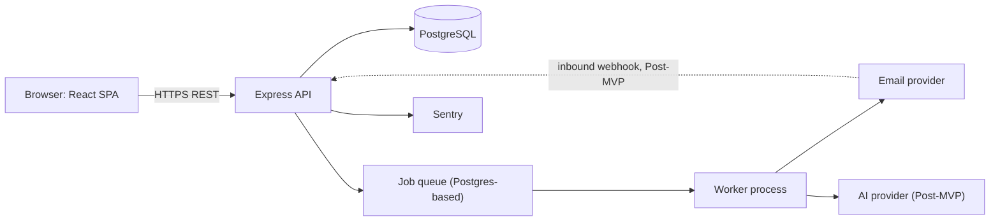
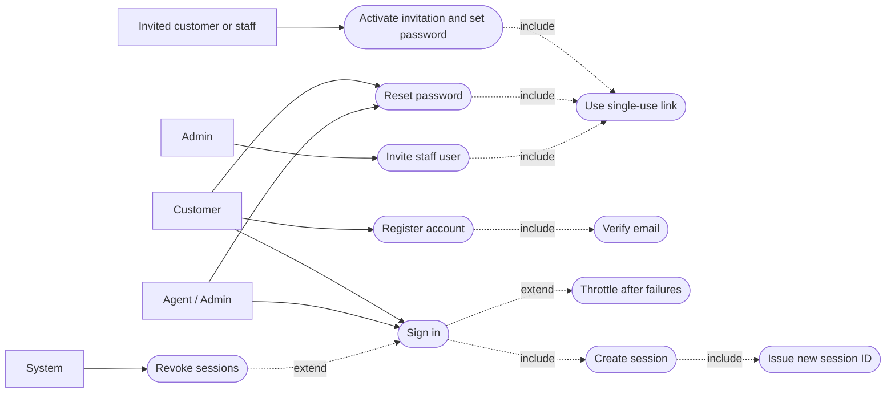
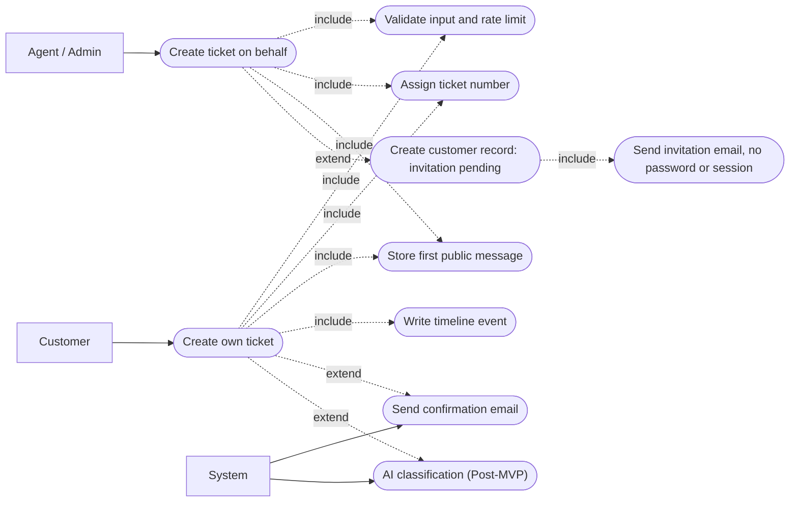
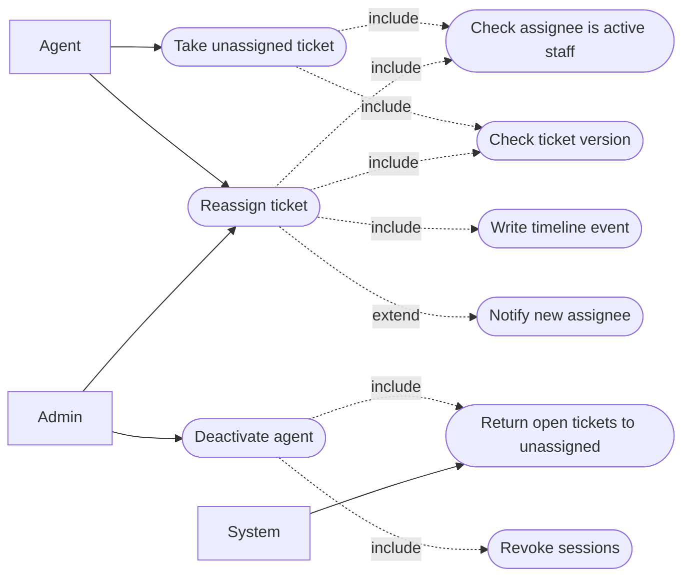
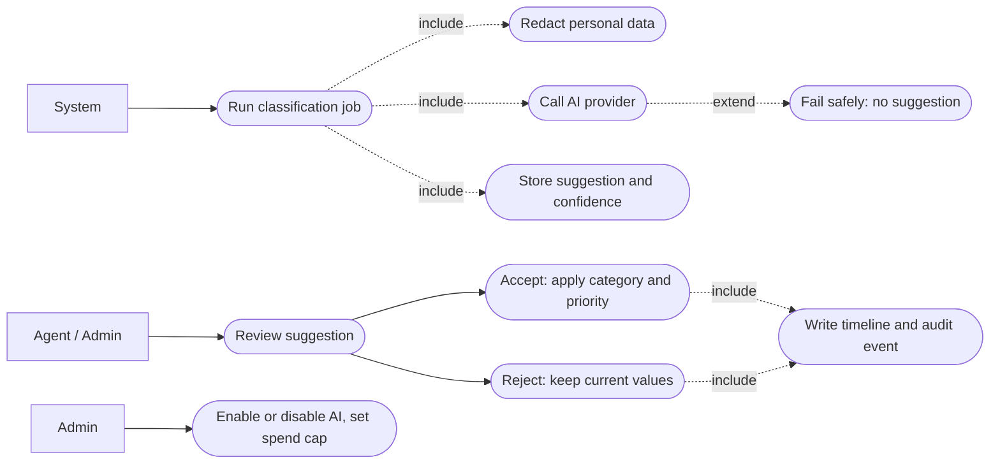
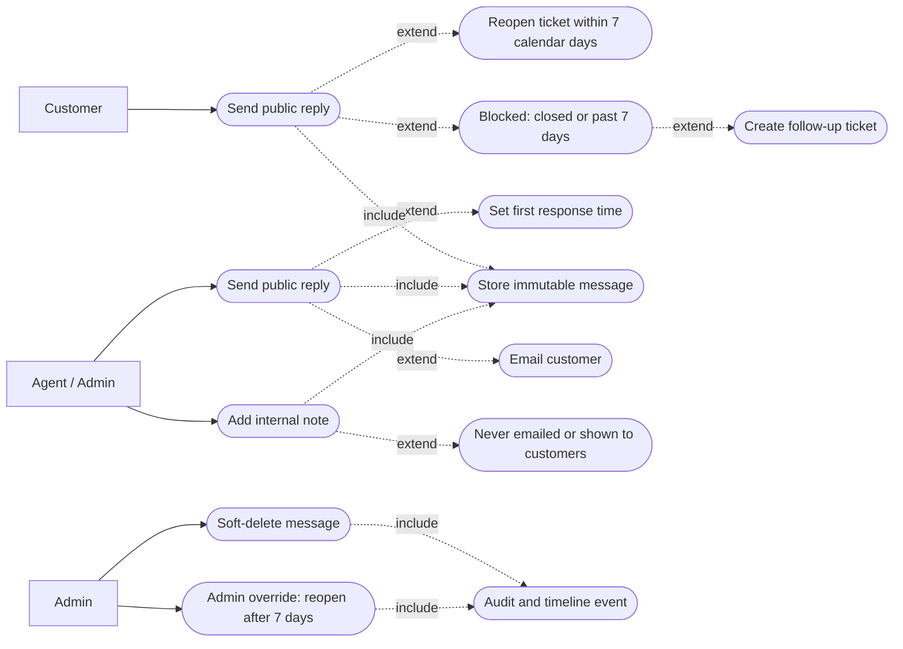

# 02 - Software Requirements Specification (SRS): NexaDesk AI

**Version:** 1.0 (Requirements Freeze Candidate - All OQ Items Resolved & Mapped) | **Status:** Ready for requirements freeze. No implementation has started.
**Decision record:** `05-decision-log.md`. All 13 OQ items from Appendix B have been mapped to approved, provisional, or external review decisions.
**Companion documents:** `03-user-stories.md`, `04-acceptance-criteria.md`, `06-antigravity-requirements-audit.md`
**Method:** Structured along IEEE 830 / ISO/IEC/IEEE 29148 conventions. This is a working project document, not a formally certified SRS.

**Reading guide.** Priority labels: **MVP** = Release 1, **Post-MVP** = Release 2, **Future** = later. "Shall" = mandatory for the stated release. All numeric targets in Section 4 are **proposed engineering goals; none has been measured or verified**. Items needing your decision are collected in Appendix B.

---

## 1. Introduction

### 1.1 Purpose
Define what NexaDesk AI shall do, for whom, and how completion is judged, so design and implementation can start from an agreed baseline.

### 1.2 Scope
NexaDesk AI is a web-based customer support ticketing system for a **single organization** (single-tenant). It lets customers raise tickets, lets support staff work them to resolution, and (after the core is stable) adds AI assistance and email-to-ticket.

**In scope (MVP):** authentication and RBAC, customer portal (8 screens), invitation flow, staff inbox, tickets, assignment, status and priority workflow, public replies and internal notes, activity timeline, categories, search/filter/sort, outbound email, background jobs for email, basic dashboard, audit-log writing, user management, production baseline.
**In scope (Post-MVP):** AI classification/summaries/suggested replies, attachments, email-to-ticket, analytics, audit-log viewer, customer directory, bulk actions, MFA.
**Out of scope:** multi-tenancy (single organization only), Super Admin role, AI auto-resolve (withdrawn, see FR-AI-005), SLA automation, knowledge base, CSAT, live chat, mobile apps, billing, public API (see discovery document, Future).

### 1.3 Product overview
Every customer issue becomes a **ticket** with an owner, status, priority, and history. AI later reduces repetitive work, but **humans stay in control**: AI only suggests, and staff accept or reject.

### 1.4 Definitions

| Term | Meaning |
|---|---|
| Ticket | A customer issue with number, status, priority, category, requester, optional assignee |
| Requester | The customer who owns the ticket |
| Public reply | A message visible to the customer and staff |
| Internal note | A message visible to Agents and Admins only |
| Agent | Support staff user (mockup: "Support Agent") |
| Admin | Staff user who also manages users, categories, settings |
| System | Automated actor: background jobs, AI, scheduled tasks. Always recorded as "System" |
| First response | Time from ticket creation to the first **public** reply by an Agent/Admin (calendar time in MVP; no business hours) |
| Open | A newly created ticket awaiting agent action (also the state after a reopen or a customer reply) |
| In Progress | An agent is actively working on the ticket |
| Pending | Waiting for a customer response or an external dependency |
| Resolved | The issue has been addressed and is awaiting confirmation or closure; customer may reply within 7 calendar days |
| Closed | The ticket lifecycle is complete; customers cannot reopen it through the standard workflow |
| Organization | The single workspace that owns all users, tickets, and settings; represented by one Organization record (OQ-15) |
| Invitation pending | Account status for a person who was invited or created by staff and has not yet set a password; cannot sign in |
| Reauthentication | Asking a signed-in user to confirm their password before a sensitive operation |
| RBAC | Role-based access control |
| Object-level authorization | Checking that this user may access this specific record, not just this endpoint |
| RPO / RTO | Max acceptable data loss / time to restore service |
| PII | Personally identifiable information |

### 1.5 References
- `docs/01-product-discovery.md` (approved) and `helpdesk_phase1_requirements_v2.docx`
- `nexadesk-mockup/` (Phase 2 mockup: index.html, styles.css, app.js)
- WCAG 2.1 (AA), OWASP Top 10, OWASP ASVS (used as a checklist reference)
- Reference product analysis from a public repository (functionality only; no code reuse)

---

## 2. Overall description

### 2.1 Product perspective
A standalone web application: React SPA, Express REST API, PostgreSQL database, background worker, and third-party email and AI services. Frontend and API are served **same-site** (one domain or reverse proxy) to keep cookie sessions and CSRF handling simple.

### 2.2 User classes

| Class | Description | Access |
|---|---|---|
| Customer | Registered, email-verified requester | Own tickets only, public messages only |
| Invitation-pending customer | Customer record created by staff; no password, no session | Nothing until the invitation is activated; then same as Customer |
| Agent | Support staff created by an Admin | All tickets, internal notes, workflow actions |
| Admin | Created by seed script or another Admin | Everything an Agent can, plus users, categories, settings, audit data |
| System | Jobs, AI, webhooks | Acts only through defined services; logged as "System" |
| Unregistered requester | Email sender without account | Post-MVP (email-to-ticket) |

### 2.3 Operating environment
- **Browsers (proposed):** current and previous major versions of Chrome, Edge, Firefox, Safari; responsive down to ~360 px width.
- **Server:** Node.js LTS (exact version pinned in design phase), PostgreSQL (version verified in design phase), Docker container.
- **Hosting:** Railway with separate local, staging, and production environments, each with its own database and secrets.

### 2.4 Constraints
- **C-1** Technology stack as chosen: React, TypeScript (strict), Vite, Tailwind, shadcn/ui, TanStack Query, React Hook Form, Zod; Node, Express, Prisma; PostgreSQL; Better Auth; OpenAI via Vercel AI SDK; Docker, GitHub Actions, Railway, Sentry. Library capabilities and versions must be **verified against current documentation** before design is frozen.
- **C-2** All authorization is enforced on the backend. The frontend may hide controls but is never trusted.
- **C-3** Secrets exist only in server environments.
- **C-4** English only; single organization (one Organization record, with `organization_id` on organization-owned tables, tenant-ready design without full multi-tenancy in MVP, see Section 8 and OQ-15); small hosting and AI budget.
- **C-5** Shared Zod schemas between client and server (monorepo or shared package).
- **C-6** Email provider: Resend is the initial outbound transactional email provider behind an application-level abstraction (`EmailService`) so the provider can be replaced later; inbound support is unverified and requires external technical review before Post-MVP email-to-ticket (OQ-11). Do NOT treat Resend as the final architectural decision for inbound.

### 2.5 Assumptions
- **A-1** Customers self-register with email verification (open registration).
- **A-2** One assignee per ticket. **A-3** Resolved tickets can be reopened by customer reply within 7 calendar days of `resolved_at` (UTC), decided in OQ-14.
- **A-4** Deleted data is soft-deleted; retention periods are defined before production (Appendix B).
- **A-5** The first Admin is created by a seed script.
- **A-6** Attachments and AI are Post-MVP.
- **A-7** The mockup is a visual and interaction reference; where it conflicts with this SRS, this SRS wins (see Appendix A). The mockup is **to be revised** (OQ-2, Appendix C) and has not yet been rebuilt.
- **A-8** Session durations (OQ-5) and retention periods (OQ-6) are provisional defaults, configurable by environment or setting, and are reviewed before production.
- **A-9** AI is disabled by default for the organization until the AI data-handling document is approved and an Admin enables it (OQ-12).

---

## 3. Functional requirements

**Roles** are Customer (C), Agent (A), Admin (AD), System (S). **Every requirement implicitly includes FR-AUTH-007 (authorization) and input validation with Zod.** "AC" = acceptance criteria. Detailed test scenarios are in `04-acceptance-criteria.md`.

### 3.1 Authentication and account (FR-AUTH)

#### FR-AUTH-001 Sign in
- **Actor:** C, A, AD | **Priority:** MVP
- **Preconditions:** Account exists, is ACTIVE, email verified.
- **Main:** User enters email and password; system validates input; verifies credentials; creates a **new** session with a new session identifier (fixation protection, FR-AUTH-009); redirects staff to their workspace and customers to the customer dashboard.
- **Alternate:** Wrong credentials, unknown email, deactivated account, or invitation-pending account: same neutral message ("Email or password is incorrect"). Unverified email: neutral message plus option to resend verification. Too many failures: FR-AUTH-006.
- **Postconditions:** Session cookie set per FR-AUTH-009; login event audited.
- **AC:** Wrong password and unknown email return identical message and status; deactivated and invitation-pending users cannot sign in; any session identifier presented before login is discarded; audit entry exists.

#### FR-AUTH-002 Customer registration and email verification
- **Actor:** C | **Priority:** MVP
- **Preconditions:** Email (normalized) not yet registered in the organization.
- **Main:** Visitor submits name, email, password; system creates a customer in unverified state; queues verification email; user opens link; account becomes verified.
- **Alternate:** Email already registered (any status): response identical to success; the existing owner receives a "you already have an account" email. If that account is INVITATION_PENDING, the invitation is re-sent (rate-limited) instead; registration never sets a password on an invited account. Expired/used link: error and resend option.
- **Postconditions:** Verified customer can sign in. Verification token single-use.
- **AC:** Password meets policy (NFR-SEC-004); link expires (proposed 24 h) and works once; the UI never reveals whether an email was already registered; no duplicate customer per (organization, normalized email).

#### FR-AUTH-003 Sign out and session expiry
- **Actor:** C, A, AD | **Priority:** MVP
- **Preconditions:** Active session.
- **Main:** User signs out; server invalidates the session and clears the cookie; user returns to sign-in.
- **Alternate:** Idle timeout or absolute lifetime (NFR-SEC-005, configurable) ends the session; user signs in again and returns to the page they wanted.
- **Postconditions:** Session unusable server-side.
- **AC:** Reusing the old session cookie after sign-out or expiry returns 401; durations come from configuration, not code constants.

#### FR-AUTH-004 Password reset
- **Actor:** C, A, AD | **Priority:** MVP
- **Preconditions:** None.
- **Main:** User requests reset with email; system always shows the same confirmation; if account exists, a single-use link is emailed; user sets new password.
- **Alternate:** Expired/used link: error and resend option. Deactivated account: no email sent, same confirmation.
- **Postconditions:** Password changed; all other sessions revoked; event audited.
- **AC:** Confirmation text identical for existing and unknown emails; link expires (proposed 1 h); old password stops working.

#### FR-AUTH-005 Profile and change password
- **Actor:** C, A, AD | **Priority:** MVP
- **Preconditions:** Signed in.
- **Main:** User edits display name. To change password the user confirms the current password (reauthentication, FR-AUTH-010) and enters a compliant new password; system saves, revokes all other sessions, and issues a new session identifier for the current one.
- **Alternate:** Wrong current password: field error, nothing changes, counts toward throttling. Email change is **not** in MVP.
- **Postconditions:** Profile updated; password change audited.
- **AC:** Other sessions rejected after change; password policy enforced.

#### FR-AUTH-006 Login throttling
- **Actor:** S | **Priority:** MVP
- **Preconditions:** Repeated failed attempts.
- **Main:** System counts failures per account and per IP; after the threshold, delays or blocks further attempts temporarily.
- **Alternate:** Throttled user sees a generic "Try again later"; successful login after the window resets the counter.
- **Postconditions:** Throttle event logged.
- **AC:** Proposed threshold: 5 failures per 15 minutes triggers backoff; limits also apply to signup, reset, and ticket creation (FR-TICKET-001); enforced in all environments, not only production.

#### FR-AUTH-007 Role and object-level authorization
- **Actor:** S | **Priority:** MVP
- **Preconditions:** Any API request.
- **Main:** For every endpoint the API checks (1) authenticated, (2) role allowed, (3) the user may access the specific object (e.g., customer owns the ticket).
- **Alternate:** Failure returns 401 (not signed in), 403 (role), or 404 (object not visible to this user, to avoid revealing existence).
- **Postconditions:** No data returned on failure.
- **AC:** An automated matrix covering every role against every endpoint runs in CI and blocks merge on failure (see 04, section 4).

#### FR-AUTH-008 Session revocation
- **Actor:** S | **Priority:** MVP
- **Preconditions:** User deactivated, role changed, or password changed/reset.
- **Main:** System invalidates the user's sessions (all, or all except the current one for self-service password change).
- **Alternate:** Revocation failure is logged and alerted; the request that triggered it fails rather than leaving sessions active.
- **Postconditions:** Revoked sessions receive 401 on next request.
- **AC:** After deactivation, the user's next request fails within one request, not at session expiry.

#### FR-AUTH-009 Session management
- **Actor:** S | **Priority:** MVP
- **Preconditions:** A user signs in.
- **Main:** Sessions are stored server-side. The cookie is Secure, HttpOnly, with SameSite=Lax (provisional; Strict is considered where flows allow) and a minimal path/domain. The idle timeout and absolute lifetime are read from environment configuration and enforced server-side. A new session identifier is issued on sign-in, password change, and role change.
- **Alternate:** Invalid or missing configuration values: the application refuses to start with a clear error, rather than silently using unsafe values.
- **Postconditions:** Revoked or expired sessions are rejected.
- **AC:** Cookie flags verified by test; with short test timeouts, idle and absolute expiry both occur; a session cookie obtained before login is invalid after login (fixation test); the configured values are documented in the deployment guide.

#### FR-AUTH-010 Reauthentication for sensitive operations
- **Actor:** C, A, AD | **Priority:** MVP
- **Preconditions:** Signed in; about to perform a sensitive operation. Provisional list: change password; change email (Future); Admin: change a user's role, deactivate or reactivate a user, invite staff, enable or disable AI, change retention settings.
- **Main:** If the last password confirmation is older than the reauthentication window (provisional 15 minutes, configurable), the system asks for the password; on success it records the time and performs the operation.
- **Alternate:** Wrong password: operation refused and failure counts toward throttling (FR-AUTH-006). Cancelled: nothing changes.
- **Postconditions:** Operation audited with the fact that reauthentication occurred.
- **AC:** Each listed operation is refused via the API without recent confirmation, even if the UI is bypassed.

#### FR-AUTH-011 Activate an invited account
- **Actor:** C, A, AD (invited person) | **Priority:** MVP
- **Preconditions:** Account is INVITATION_PENDING; person has a valid, unexpired, single-use invitation link.
- **Main:** Person opens the link; confirms name; sets a compliant password; system activates the account, marks the email verified (the link was delivered to that address), invalidates the link, and sends the person to the sign-in page.
- **Alternate:** Expired or used link: error, with a neutral "request a new invitation" action (rate-limited). Staff may resend an invitation.
- **Postconditions:** Status ACTIVE; tickets already linked to the customer are visible after sign-in; activation audited.
- **AC:** No password is ever generated or set by staff or the system; no session is created at activation; invitation tokens are stored hashed; default invitation lifetime 7 days, configurable (provisional, OQ-21).

### 3.2 Tickets (FR-TICKET)

#### FR-TICKET-001 Create ticket (customer)
- **Actor:** C | **Priority:** MVP
- **Preconditions:** Signed in, verified.
- **Main:** Customer enters subject, description, category; system validates; creates ticket as **Open**, priority **Medium**, unassigned; stores description as first public message; queues confirmation email; shows ticket detail.
- **Alternate:** Validation errors shown per field. Rate limit exceeded: 429 with message. Email queue failure never blocks creation (FR-NOTIF-002).
- **Postconditions:** Ticket, first message, timeline event "Created" exist.
- **AC:** Subject 5 to 200 chars; description 10 to 10,000 chars; customer cannot supply priority, assignee, or status; creation limit proposed at 10 tickets per hour per customer.

#### FR-TICKET-002 Create ticket on behalf of customer
- **Actor:** A, AD | **Priority:** MVP
- **Preconditions:** Staff signed in.
- **Main:** Staff enters customer email, subject, description, category, optional priority. The system normalizes the email (trim, lowercase) and looks it up within the organization. If found, the ticket is linked to that customer. If not found (decision OQ-3), in one transaction it: creates a customer record in the same organization with status INVITATION_PENDING (no password, no session), creates the ticket linked to it, and queues an invitation email through the configured email service. The invitation contains the ticket number but not the ticket text.
- **Alternate:** Invalid email: field error. Deactivated customer: blocked. Two staff creating tickets for the same new email at once: the unique constraint on (organization, normalized email) yields one customer. Email service down: customer and ticket are still created; the invitation is retried (FR-NOTIF-002) and staff can resend it.
- **Postconditions:** Timeline: "Created by [staff] on behalf of customer". Audit: customer record created by [staff].
- **AC:** Requester is the customer, not the staff member; no authenticated session and no password are created; no duplicate customer is possible; the customer can activate via FR-AUTH-011 and then sees the ticket.

#### FR-TICKET-003 Ticket number
- **Actor:** S | **Priority:** MVP
- **Preconditions:** Ticket being created.
- **Main:** System assigns the next number from a database sequence and formats it for display in the customer-facing ticket number format `NX-000001` (prefix `NX-`, six-digit zero-padded sequence, e.g., NX-000001, NX-000042, NX-001042; Decision 1, OQ-4). This formatted ticket number is unique per organization. The database uses an internal stable identifier (UUID PK), NOT this formatted ticket number.
- **Alternate:** Concurrent creations still receive distinct sequential numbers; gaps are allowed.
- **Postconditions:** Number immutable.
- **AC:** Formatted ticket numbers are unique, six-digit zero-padded with `NX-` prefix; shown in lists, detail, search, and email subjects; decoupled from the database primary key.

#### FR-TICKET-004 List, filter, sort, paginate
- **Actor:** C (own), A, AD | **Priority:** MVP
- **Preconditions:** Signed in.
- **Main:** User opens the list; may filter by status, priority, category, assignee (including unassigned), date range; sort by created, updated, priority; results are paginated.
- **Alternate:** No matches: empty state with "clear filters". Invalid parameters: 400 with details.
- **Postconditions:** None.
- **AC:** Default page size 25, maximum 100; customers never receive other customers' tickets whatever the filters; combined filters are ANDed.

#### FR-TICKET-005 Search
- **Actor:** C (own), A, AD | **Priority:** MVP
- **Preconditions:** Signed in.
- **Main:** User searches by ticket number, subject text, or requester name/email (staff only); system returns matching tickets within permission scope.
- **Alternate:** No results: empty state. Search of message bodies is Post-MVP.
- **Postconditions:** None.
- **AC:** Search is indexed; results respect visibility rules; special characters are handled safely.

#### FR-TICKET-006 View ticket
- **Actor:** C (own), A, AD | **Priority:** MVP
- **Preconditions:** Ticket exists and is visible to the user.
- **Main:** System shows subject, number, status, priority, category, requester, assignee, conversation, and (staff only) internal notes and full timeline.
- **Alternate:** Not found or not permitted: 404.
- **Postconditions:** None.
- **AC:** Customer responses contain no internal notes, internal timeline entries, or assignee details beyond display name, verified at the data-access layer.

#### FR-TICKET-007 Change status
- **Actor:** A, AD (S for automatic transitions) | **Priority:** MVP
- **Preconditions:** Ticket not soft-deleted; transition allowed by BR-LC-001.
- **Main:** Staff picks a new status and may enter an optional reason (up to 500 characters, staff-only). The system checks the version (FR-TICKET-010) and BR-LC-001, saves, and writes a timeline event with previous status, new status, actor, timestamp, and reason. Messages and assignee are left unchanged. A notification may be queued (BR-NT-001).
- **Alternate:** Illegal transition: 422 with reason. Closed to Open, and Resolved to Open after the 7-day window: Admin only, audited (OQ-14).
- **Postconditions:** `resolved_at` set on Resolved (UTC) and replaced on each new resolution; `closed_at` set or cleared.
- **AC:** In Progress to Open succeeds for Agent and Admin, with and without a reason, and keeps the assignee and all messages (OQ-13); every transition in BR-LC-001 is tested allowed, every other transition rejected; each change creates a timeline event.

#### FR-TICKET-008 Change priority and category
- **Actor:** A, AD | **Priority:** MVP
- **Preconditions:** Staff signed in.
- **Main:** Staff selects new priority (Low, Medium, High, Urgent) or category; system saves with version check; writes timeline event.
- **Alternate:** Inactive category: rejected. Customer attempt: 403.
- **Postconditions:** Event recorded.
- **AC:** Customers cannot set priority at creation or later.

#### FR-TICKET-009 Assign and reassign
- **Actor:** A, AD | **Priority:** MVP
- **Preconditions:** Target is an active Agent or Admin.
- **Main:** Staff picks an assignee (or "Take it" for self, or "Unassigned"); system saves with version check; writes timeline event; notifies the new assignee unless self-assigned.
- **Alternate:** Inactive/customer target: rejected. Resolved or Closed tickets may be reassigned by Admin only.
- **Postconditions:** One assignee or none.
- **AC:** Dropdown lists only active staff; assignment event audited.

#### FR-TICKET-010 Concurrency control
- **Actor:** S | **Priority:** MVP
- **Preconditions:** Two users editing the same ticket.
- **Main:** Every ticket update sends the version it was based on; if it differs from the stored version, the update is refused with a conflict.
- **Alternate:** UI shows "This ticket changed. Refresh to see the latest" and keeps the user's draft text.
- **Postconditions:** No silent overwrite.
- **AC:** Test with two concurrent updates: exactly one succeeds, one gets 409.

#### FR-TICKET-011 Customer cancel and reopen
- **Actor:** C, S | **Priority:** MVP
- **Preconditions:** Own ticket.
- **Main:** (a) A customer may cancel an **Open** ticket; it becomes Closed with reason "Cancelled by customer". (b) A customer public reply on a Resolved ticket is accepted if the reply time is not later than `resolved_at` + 7 calendar days (UTC, inclusive); the ticket moves to Open and the reopening is written to the timeline **and** the audit log. (c) A customer public reply on a Pending ticket moves it to Open.
- **Alternate:** After the window, or when Closed: the reply is blocked with an explanation and a "Create follow-up ticket" action that creates a new ticket linked to the old one (`parent_ticket_id`, OQ-19). An Admin may override by reopening the ticket (FR-TICKET-007) with an audit record; the customer can then reply.
- **Postconditions:** Timeline and audit record the actor and reason; a later resolution starts a fresh 7-day window.
- **AC:** Boundary tests at the deadline and one second after; the deadline uses calendar days in UTC (7 x 24 hours), never business days; customers cannot cancel once the ticket is In Progress; customers cannot perform any other status transition.

#### FR-TICKET-012 Activity timeline
- **Actor:** S | **Priority:** MVP
- **Preconditions:** A tracked change occurs.
- **Main:** System appends an event for creation, status (previous and new value, optional reason), priority, assignee, category, message deletion, reopen, and cancel. Staff see the timeline on the ticket; assignment history is preserved by the events.
- **Alternate:** System-triggered events show actor "System".
- **Postconditions:** Events are append-only.
- **AC:** No change to tracked fields is possible without an event; events cannot be edited via the API; reasons are never shown to customers.

#### FR-TICKET-013 Bulk actions
- **Actor:** A, AD | **Priority:** Post-MVP
- **Preconditions:** Staff selected multiple tickets in the inbox.
- **Main:** Staff applies status, priority, or assignee to the selection; system validates each ticket independently.
- **Alternate:** Partial failure: report which tickets succeeded and failed.
- **Postconditions:** One timeline event per ticket.
- **AC:** Illegal transitions are skipped and reported, never forced. (The mockup shows bulk "Mark resolved"; see Appendix A.)

### 3.3 Conversation (FR-CONV)

#### FR-CONV-001 Public reply
- **Actor:** C (own tickets), A, AD | **Priority:** MVP
- **Preconditions:** Ticket visible; replying allowed (not blocked per FR-TICKET-011).
- **Main:** User writes a reply (1 to 10,000 chars) and sends; system saves it as a public message; updates last activity; first staff public reply sets `first_response_at`; queues notification.
- **Alternate:** Empty text: validation error. Conflict: draft preserved.
- **Postconditions:** Message immutable; customer reply may change status per FR-TICKET-011.
- **AC:** Text rendered as plain text (no raw HTML); reply from another customer's session returns 404.

#### FR-CONV-002 Internal note
- **Actor:** A, AD | **Priority:** MVP
- **Preconditions:** Staff; ticket visible.
- **Main:** Staff switches composer to "Internal note", writes, saves; note is stored as type INTERNAL.
- **Alternate:** Customer attempts: 403.
- **Postconditions:** No email is sent for notes.
- **AC:** Notes never appear in any customer API response, customer email, search result for customers, or AI input to customer-visible drafts (SEC-9).

#### FR-CONV-003 Message immutability and deletion
- **Actor:** AD | **Priority:** MVP
- **Preconditions:** Message exists.
- **Main:** Messages cannot be edited after sending. An Admin may soft-delete a message; it is hidden from customers and shown to staff as "Deleted by [Admin]".
- **Alternate:** Agent or Customer attempts deletion: 403.
- **Postconditions:** Deletion audited and in timeline.
- **AC:** Deleted content is not returned to customers; deletion reason optional.

#### FR-CONV-004 Visibility filtering
- **Actor:** S | **Priority:** MVP
- **Preconditions:** Any response containing messages or events.
- **Main:** The data-access layer applies visibility by role before data leaves the database layer.
- **Alternate:** A query lacking a role context fails closed.
- **Postconditions:** None.
- **AC:** Tests call every ticket-related endpoint as Customer and assert absence of internal data.

### 3.4 Notifications and jobs (FR-NOTIF)

#### FR-NOTIF-001 Outbound email
- **Actor:** S | **Priority:** MVP
- **Preconditions:** A notifying event occurred (BR-NT-001).
- **Main:** System queues an email job; the worker renders the template and sends through the configured email service only; marks the result.
- **Alternate:** Send failure: retry with backoff (FR-NOTIF-002). Invitation emails (FR-TICKET-002, FR-ADMIN-002) carry a single-use activation link and, for customers created by staff, the ticket number only.
- **Postconditions:** Outbound email record exists with status.
- **AC:** Emails contain the ticket number in the subject where relevant; never contain internal notes or reasons; links require sign-in or activation.

#### FR-NOTIF-002 Delivery reliability
- **Actor:** S | **Priority:** MVP
- **Preconditions:** Email job failing.
- **Main:** Worker retries (proposed 5 attempts, exponential backoff); after the last attempt the job is marked FAILED and visible to Admin.
- **Alternate:** Worker restarts mid-job: job is retried, not lost; graceful shutdown completes or releases the current job.
- **Postconditions:** Failure alert sent to monitoring.
- **AC:** Ticket creation and replies succeed even when the email provider is down.

#### FR-NOTIF-003 Notification preferences
- **Actor:** C, A, AD | **Priority:** Post-MVP
- **Preconditions:** Signed in.
- **Main:** User toggles optional notification types. **Alternate:** Security/auth emails cannot be disabled.
- **Postconditions:** Preferences stored. **AC:** Disabled optional types are not sent.

### 3.5 AI assistance (FR-AI), all Post-MVP

Common rules: BR-AI-001 to BR-AI-015 (the privacy-first AI policy, OQ-12) and FR-AI-006 apply to every AI requirement. AI is **disabled by default**, runs only in backend background jobs, and fails safely: AI failure never blocks any ticket action.

#### FR-AI-001 Classification suggestion
- **Actor:** S (produces), A/AD (decide) | **Priority:** Post-MVP
- **Preconditions:** New ticket; AI enabled for the organization (FR-AI-004).
- **Main:** Job sends only the redacted subject and public message text needed for classification; the response is validated against a strict schema (category from active categories, priority enum, confidence 0 to 1) and stored as a suggestion; staff see it and accept or reject.
- **Alternate:** Provider error or timeout: no suggestion; the ticket is unaffected. Low confidence: displayed as low or hidden per setting (display only). Invalid output: discarded.
- **Postconditions:** Model, task type, processing time, and decision are recorded; the prompt is not stored.
- **AC:** Ticket fields change only after a staff accept, performed as a normal staff change (FR-TICKET-008) in the staff member's name.

#### FR-AI-002 Thread summary
- **Actor:** A, AD | **Priority:** Post-MVP
- **Preconditions:** AI enabled; ticket with 2 or more messages.
- **Main:** Summary generated from public messages only (internal notes are not sent to the provider in the first AI release, OQ-20) and shown to staff, labeled AI-generated.
- **Alternate:** Failure: "Summary unavailable".
- **Postconditions:** Summary stored with the message count it covers, under the retention rules in BR-RET.
- **AC:** Customers never see summaries; the summary is not written into any customer-visible field.

#### FR-AI-003 Suggested reply
- **Actor:** A, AD | **Priority:** Post-MVP
- **Preconditions:** AI enabled; ticket open to staff.
- **Main:** Draft generated from public messages only; it appears in the editor as text; the agent must review, may edit, and sends it through the normal reply action.
- **Alternate:** Failure: no draft. Agent discards: recorded as rejected.
- **Postconditions:** The sent message belongs to the agent and records the AI suggestion it came from (for audit).
- **AC:** There is no code path that sends an AI draft without a human send action; the Send control cannot be triggered by the AI job.

#### FR-AI-004 AI controls
- **Actor:** AD | **Priority:** Post-MVP
- **Preconditions:** Admin; recent reauthentication (FR-AUTH-010).
- **Main:** An Admin can enable or disable AI for the organization and per feature, set a monthly spend cap and rate limits. AI is off until explicitly enabled.
- **Alternate:** Cap reached: AI pauses and the Admin is alerted. Disabled: queued AI jobs are dropped without calling the provider.
- **Postconditions:** Changes audited.
- **AC:** Disabling takes effect on the next job without redeploy; no provider call is made while disabled.

#### FR-AI-005 AI auto-resolve (WITHDRAWN)
- **Actor:** n/a | **Priority:** Withdrawn
- **Reason:** Decision OQ-12, rule 11: AI must never independently close tickets, issue refunds, modify accounts, or perform privileged actions. Automatic resolution conflicts with that rule.
- **Main / Alternate / Preconditions / Postconditions:** None. Not designed or built.
- **AC:** Reinstating this would require an explicit, documented amendment of the AI policy and a new SRS version.

#### FR-AI-006 AI privacy and safety controls
- **Actor:** S | **Priority:** Post-MVP, **mandatory before any AI implementation**
- **Preconditions:** None; this is a gate.
- **Main:** (1) All AI calls go through the backend service; no AI key exists in frontend code or bundles. (2) Inputs follow an allow-list: subject and public message text only; passwords, tokens, cookies, and unneeded personal data are never sent; redaction runs first (best effort, not a guarantee). (3) The provider is configured so customer data is not used for model training, and its contractual data-handling and retention settings are followed and recorded. (4) Ticket text is untrusted: it is delimited as data, the model has no tools or write access, and its output is schema-validated and rendered as plain text. (5) Application logs contain no full ticket text and no prompts. (6) AI results are visible only to staff with access to that ticket. (7) Each run records model, provider, task type, timestamp, and outcome, but not the prompt. (8) Timeouts and a circuit breaker make AI fail safely. (9) A document `docs/ai-data-handling.md` describes provider, data flow, retention, privacy controls, and failure handling.
- **Alternate:** Any control cannot be met: the AI feature stays disabled.
- **Postconditions:** Policy document approved and linked from the release checklist.
- **AC:** Checklist in `04-acceptance-criteria.md` section 6.4 fully passed and recorded before AI code is merged to main.

### 3.6 Email-to-ticket (FR-EMAIL), Post-MVP

#### FR-EMAIL-001 Inbound email creates ticket
- **Actor:** S | **Priority:** Post-MVP
- **Preconditions:** Provider supports inbound (verified); webhook secret configured.
- **Main:** Provider posts email to a signed webhook; system verifies signature, de-duplicates by message ID, sanitizes content, creates or links a requester, creates ticket.
- **Alternate:** Bad signature: 401, nothing stored. Spoof/auth-fail (SPF/DKIM): flagged, not trusted. Auto-reply/bounce: ignored.
- **Postconditions:** Ticket created by "System".
- **AC:** Replays create no duplicates; HTML is never rendered raw.

#### FR-EMAIL-002 Email reply threading
- **Actor:** S | **Priority:** Post-MVP
- **Preconditions:** Customer replies to a notification.
- **Main:** System matches the ticket number or thread headers and appends a public message.
- **Alternate:** No match: new ticket or review queue (to decide). **Postconditions:** Normal reply rules apply. **AC:** Replies from addresses not belonging to the requester are not appended automatically.

### 3.7 Administration (FR-ADMIN)

#### FR-ADMIN-001 First admin bootstrap
- **Actor:** S | **Priority:** MVP
- **Preconditions:** Empty database.
- **Main:** Seed script creates the Organization record, the first Admin from environment-provided values, and the default categories.
- **Alternate:** Organization or Admin already exists: script makes no changes.
- **Postconditions:** One verified Admin in one Organization.
- **AC:** No default credentials in the repository.

#### FR-ADMIN-002 Invite or create staff
- **Actor:** AD | **Priority:** MVP
- **Preconditions:** Admin signed in; recent reauthentication.
- **Main:** Admin enters email and role (Agent or Admin); system creates an INVITATION_PENDING user and emails a single-use link; the person activates via FR-AUTH-011.
- **Alternate:** Email already used in the organization: field error. Invitation expired: Admin can resend.
- **Postconditions:** Audited. **AC:** Invited user cannot sign in before activating; no password is set by the Admin.

#### FR-ADMIN-003 Change role and deactivate
- **Actor:** AD | **Priority:** MVP
- **Preconditions:** Target user exists; recent reauthentication.
- **Main:** Admin changes role or deactivates; system revokes sessions (FR-AUTH-008); the user's tickets in Open, In Progress, or Pending return to unassigned; Resolved and Closed tickets keep the historical assignee; audited.
- **Alternate:** The last active Admin cannot be demoted or deactivated. An Admin cannot deactivate themselves.
- **Postconditions:** A timeline event (actor "System") for each reassigned ticket. **AC:** Attempt to remove the last Admin returns an error and changes nothing.

#### FR-ADMIN-004 Manage categories
- **Actor:** AD | **Priority:** MVP
- **Preconditions:** Admin.
- **Main:** Admin creates, renames, reorders, deactivates categories; seed data provides Billing, Technical, Account, Refund, General.
- **Alternate:** Used category cannot be hard-deleted; deactivate instead. **Postconditions:** Deactivated categories are not selectable for new tickets but remain on old ones. **AC:** Names unique (case-insensitive).

#### FR-ADMIN-005 Audit logging
- **Actor:** S | **Priority:** MVP (write only)
- **Preconditions:** Auditable action occurs.
- **Main:** System appends an audit record for: sign-in success and failure, password change/reset, reauthentication failure, invitation created/activated, customer record created by staff, role change, deactivation, assignment, message deletion, category changes, ticket reopened (customer reply or Admin override), AI enable/disable, retention-setting changes, and each retention purge run (counts only).
- **Alternate:** Audit write failure on a security-critical action fails the action.
- **Postconditions:** Append-only record without message content or prompts. **AC:** Actor shown as "System" for automated actions, never blank.

#### FR-ADMIN-006 Organization settings
- **Actor:** AD | **Priority:** MVP (minimal)
- **Preconditions:** Admin.
- **Main:** Admin edits organization name, time zone, and support display address, and (Post-MVP) AI enablement. Email and AI provider keys, and session durations, are **environment configuration**, not editable in the UI.
- **Alternate:** Invalid values rejected. **Postconditions:** Audited. **AC:** No secret is returned by any settings endpoint.

#### FR-ADMIN-007 Audit log viewer
- **Actor:** AD | **Priority:** Post-MVP
- **Main:** Admin searches and filters audit records by actor, action, date. **Alternate:** None found: empty state. **Preconditions:** Admin. **Postconditions:** None. **AC:** Paginated; read-only.

#### FR-ADMIN-008 Retention configuration
- **Actor:** AD | **Priority:** MVP (configuration and documentation); automated purge required before Production
- **Preconditions:** Admin; recent reauthentication.
- **Main:** Retention periods (BR-RET) are stored as configuration with the provisional defaults, shown to the Admin, and editable within allowed bounds. The documented deletion policy states what is soft-deleted, what is purged, and when.
- **Alternate:** Purging stays disabled until the policy is approved; nothing required for legal or security purposes is permanently deleted without an approved policy.
- **Postconditions:** Changes audited. **AC:** Changing a period changes the next purge run; every purge run logs counts, never content.

#### FR-PRIV-001 Customer data deletion and export request
- **Actor:** C (requests), AD (handles) | **Priority:** Post-MVP tooling; a documented manual procedure is required for Production
- **Preconditions:** Verified customer request.
- **Main:** Admin follows the procedure: verify identity, export the customer's data, and erase or anonymize personal fields where legally permitted while keeping records the retention policy requires.
- **Alternate:** Legal hold or obligation to retain: request partly declined with explanation. Backups keep older copies until their schedule expires (stated to the customer).
- **Postconditions:** Request and outcome audited. **AC:** Procedure reviewed for legal and privacy suitability before Production.

### 3.8 Dashboard, customers, attachments

#### FR-DASH-001 Basic dashboard
- **Actor:** A, AD | **Priority:** MVP
- **Preconditions:** Staff signed in.
- **Main:** Shows counts: total, by status, unassigned, by agent; recent tickets; recent activity. Each count links to the filtered inbox.
- **Alternate:** No data: zero values and a "Create ticket" prompt.
- **Postconditions:** None. **AC:** Counts equal the corresponding inbox filter totals.

#### FR-DASH-002 Analytics
- **Actor:** AD | **Priority:** Post-MVP
- **Main:** Ticket volume, first-response and resolution times, agent performance, priority distribution, using definitions in 1.4. **Alternate:** Insufficient data: say so. **Preconditions:** Admin. **Postconditions:** None. **AC:** Each metric has a written definition and a test with known data.

#### FR-CUST-001 Customer directory
- **Actor:** A, AD | **Priority:** Post-MVP
- **Main:** Staff search customers and view profile and ticket history. **Alternate:** No match: empty state. **Preconditions:** Staff. **Postconditions:** None. **AC:** Shows only customer role users. (MVP uses the user list in Admin.)

#### FR-ATT-001 Attachments
- **Actor:** C, A, AD | **Priority:** Post-MVP
- **Main:** Users attach files to messages; system checks type allow-list and size, scans for malware, stores privately, serves via short-lived signed links.
- **Alternate:** Rejected type/size or failed scan: file refused with reason. **Preconditions:** Storage and scanner chosen. **Postconditions:** File linked to message. **AC:** Files never rendered inline from untrusted types; internal-note attachments are staff-only.

### 3.9 Customer portal and role interfaces (FR-PORTAL, FR-UI)

These screens must exist in the revised mockup (Appendix C) and in the product. Each reuses the FRs named.

#### FR-PORTAL-001 Customer registration screen
- **Actor:** C | **Priority:** MVP | **Uses:** FR-AUTH-002
- **Preconditions:** Not signed in.
- **Main:** Form with name, email, password (policy hints), confirmation; submit shows the neutral "check your email" page; resend-verification action.
- **Alternate:** Field errors inline; rate-limit message.
- **Postconditions:** As FR-AUTH-002. **AC:** Labeled fields, keyboard operable; same confirmation for new and existing emails.

#### FR-PORTAL-002 Customer login screen
- **Actor:** C | **Priority:** MVP | **Uses:** FR-AUTH-001, 004
- **Preconditions:** Not signed in.
- **Main:** Email, password, Remember me, Forgot password, Sign in, link to register; success routes authenticated customers to the Customer Dashboard (FR-PORTAL-003).
- **Alternate:** Neutral error for every failure type, including invitation-pending accounts (with a hint to check the invitation email).
- **Postconditions:** Session per FR-AUTH-009. **AC:** Customer credentials never open staff screens.

#### FR-PORTAL-003 Customer dashboard
- **Actor:** C | **Priority:** MVP | **Uses:** FR-TICKET-004
- **Preconditions:** Signed in as Customer.
- **Main:** Authenticated Customer landing page (Decision 2) providing: ticket summary (counts of own tickets by the five statuses), open tickets, pending tickets ("Needs your reply"), recently resolved tickets, recent activity, Create Ticket action, and navigation to "My Tickets" (FR-PORTAL-005). "My Tickets" remains the full ticket-list view.
- **Alternate:** No tickets: empty state encouraging a first ticket with a prominent "Create Ticket" action.
- **Postconditions:** None. **AC:** Counts match My tickets filters and include only the customer's own tickets; all dashboard widgets display only the authenticated customer's own data; no staff-only or internal information is exposed.

#### FR-PORTAL-004 Submit a ticket
- **Actor:** C | **Priority:** MVP | **Uses:** FR-TICKET-001
- **Preconditions:** Signed in.
- **Main:** Subject, description, category; no priority control; attachment area shown only when attachments are released (Post-MVP).
- **Alternate:** Validation and rate-limit errors. **Postconditions:** Confirmation with ticket number.
- **AC:** Same limits as FR-TICKET-001.

#### FR-PORTAL-005 My tickets
- **Actor:** C | **Priority:** MVP | **Uses:** FR-TICKET-004, 005
- **Preconditions:** Signed in.
- **Main:** Paginated list of own tickets with number, subject, status, last update, assigned agent display name; filter by status; search by number or subject; sort.
- **Alternate:** No match: empty state. **Postconditions:** None. **AC:** Another customer's ticket is never listed or reachable by ID.

#### FR-PORTAL-006 Ticket details (customer view)
- **Actor:** C | **Priority:** MVP | **Uses:** FR-TICKET-006
- **Preconditions:** Own ticket.
- **Main:** Number, subject, status, priority, category, assignee display name, public conversation, and allowed actions (reply, cancel if Open).
- **Alternate:** Not visible: 404 page. **Postconditions:** None.
- **AC:** Customers see the assigned agent's display name only (OQ-9); no internal notes, private employee information, internal audit information, AI output, or staff-only reasons are rendered or present in the API response.

#### FR-PORTAL-007 Conversation and reply interface
- **Actor:** C | **Priority:** MVP | **Uses:** FR-CONV-001, FR-TICKET-011
- **Preconditions:** Own ticket.
- **Main:** Chronological public messages; reply box; send shows success state.
- **Alternate:** When replying is blocked (Closed, or Resolved more than 7 calendar days ago) the box is replaced by an explanation and "Create follow-up ticket". Pending tickets show "We are waiting for your reply".
- **Postconditions:** As FR-CONV-001. **AC:** Plain-text rendering; draft kept on error.

#### FR-PORTAL-008 Customer profile
- **Actor:** C | **Priority:** MVP | **Uses:** FR-AUTH-005
- **Preconditions:** Signed in.
- **Main:** Edit name; email shown read-only; change password with confirmation; link to the data deletion/export request information (FR-PRIV-001).
- **Alternate:** Wrong current password: error. **Postconditions:** Other sessions revoked on password change. **AC:** Reauthentication enforced server-side.

#### FR-UI-001 Separate interfaces for Admin, Agent, and Customer
- **Actor:** C, A, AD | **Priority:** MVP
- **Preconditions:** Signed in.
- **Main:** Three interfaces with their own navigation: **Customer portal** (Dashboard, My tickets, Submit a ticket, Profile); **Agent workspace** (Dashboard, Inbox, Create ticket, Profile; Customers is Post-MVP); **Admin console** (everything an Agent has, plus Team, Categories, Organization settings; Audit log and AI settings Post-MVP). Sign-in routes each user to their own interface.
- **Alternate:** A user opening another role's URL sees a 403/404 page. Hiding links is a convenience only; the server enforces access (FR-AUTH-007).
- **Postconditions:** None. **AC:** Test each role against each interface's routes and API endpoints.

#### FR-UI-002 Required UI states
- **Actor:** All | **Priority:** MVP
- **Main:** Every list and form has loading, empty, success, and error states.
- **Alternate:** Network failure shows a retry action. **Preconditions / Postconditions:** None. **AC:** Reviewed per screen in the mockup and component tests.

---

## 4. Non-functional requirements

All targets are **proposed engineering goals, not verified results**. Each has a verification method in `04-acceptance-criteria.md`.

| ID | Area | Requirement (proposed target) |
|---|---|---|
| NFR-PERF-001 | Performance | Server response time p95 under 300 ms for non-AI list/detail endpoints, at the capacity in NFR-SCAL-001, measured on staging |
| NFR-PERF-002 | Performance | Main screens usable (Largest Contentful Paint under 2.5 s) on a mid-range laptop over broadband |
| NFR-PERF-003 | Performance | All list endpoints paginated; no unbounded queries; indexes on status, assignee, requester, created date, ticket number |
| NFR-SCAL-001 | Scalability | Design capacity: 100 staff, 5,000 customers, 100,000 tickets, 500,000 messages, 50 concurrent users |
| NFR-SCAL-002 | Scalability | API stateless so more instances can run; worker scalable separately |
| NFR-AVAIL-001 | Availability | 99.5% monthly uptime target for MVP (about 3.6 h/month max downtime); an internal operational target, not a contractual SLA (OQ-8 approved) |
| NFR-AVAIL-002 | Availability | Health and readiness endpoints; graceful shutdown on termination signals; zero-downtime deploy is not required |
| NFR-SEC-001 | Security | Authentication, role, and object ownership checked on every endpoint (FR-AUTH-007) |
| NFR-SEC-002 | Security | Zod validation on all bodies, params, queries; unknown fields rejected |
| NFR-SEC-003 | Security | CSRF protection, Secure/HttpOnly/SameSite cookies, CORS allow-list, security headers and CSP |
| NFR-SEC-004 | Security | Password policy: minimum 10 characters, checked against a common-password list; hashed with a modern adaptive algorithm via the auth library (verified in design) |
| NFR-SEC-005 | Security | Session durations (provisional, OQ-5; configurable by environment): idle timeout 8 hours; absolute lifetime 30 days with "Remember me" and 24 hours without it. The 24-hour figure is a gap-filling proposal (OQ-16). Exact configured values are documented in the deployment guide |
| NFR-SEC-006 | Security | Rate limiting on login, signup, reset, ticket creation, webhook, and AI endpoints, in all environments |
| NFR-SEC-007 | Security | Output encoding for all user text; no raw HTML rendering |
| NFR-SEC-008 | Security | Secrets only in server environment; never in frontend bundle or repository |
| NFR-SEC-009 | Security | Internal notes excluded at the data-access layer, not only in the UI |
| NFR-SEC-010 | Security | Dependency vulnerability scanning in CI; no known high/critical issues at release |
| NFR-SEC-011 | Security | Authorization test matrix runs in CI |
| NFR-SEC-012 | Security | Cookie policy: Secure, HttpOnly, SameSite=Lax (provisional), minimal path and domain; session invalidated on logout |
| NFR-SEC-013 | Security | New session identifier on sign-in, password change, and role change (session fixation protection) |
| NFR-SEC-014 | Security | Reauthentication window 15 minutes (provisional, configurable) for the sensitive operations in FR-AUTH-010 |
| NFR-PRIV-001 | Privacy | Collect only needed personal data; PII scrubbed from logs and Sentry |
| NFR-PRIV-002 | Privacy | AI follows the privacy-first AI policy (BR-AI-001..015, FR-AI-006). AI is disabled by default; no AI code is merged before the data-handling document and provider settings are approved |
| NFR-PRIV-003 | Privacy | Retention periods are documented and configurable (defaults in BR-RET, provisional). Tickets 24 months after close and audit logs 12 months were accepted provisionally; every period needing legal or privacy review is flagged before production. Applicable law (for example GDPR, India's DPDP Act) is checked with a qualified adviser |
| NFR-PRIV-004 | Privacy | Backups have their own retention schedule (BR-RET) and the deletion policy states how deleted data ages out of backups |
| NFR-PRIV-005 | Privacy | Customer data deletion respects legal obligations; records required for legal or security purposes are not permanently deleted without an approved policy |
| NFR-PRIV-006 | Privacy | Logs contain no full ticket content and no AI prompts |
| NFR-A11Y-001 | Accessibility | WCAG 2.1 AA as goal: keyboard operable, labeled controls, visible focus, 4.5:1 text contrast, accessible error messages, accessible modals |
| NFR-MAINT-001 | Maintainability | TypeScript strict mode; lint and type-check clean; no `any` without justification |
| NFR-MAINT-002 | Maintainability | Automated tests on business rules and authorization; proposed line-coverage goal of 80% on business logic |
| NFR-MAINT-003 | Maintainability | Versioned migrations; README, setup guide, architecture doc, runbook kept current |
| NFR-REL-001 | Reliability | Email or AI failure never blocks ticket creation or replies |
| NFR-REL-002 | Reliability | Jobs are idempotent; failed jobs retry then land in a visible FAILED state |
| NFR-REL-003 | Reliability | Concurrent edits never silently overwrite (FR-TICKET-010) |
| NFR-OBS-001 | Observability | Structured JSON logs with request ID; no PII or ticket content in logs |
| NFR-OBS-002 | Observability | Sentry for API, worker, and frontend errors, with data scrubbing |
| NFR-OBS-003 | Observability | Alerts to a monitored channel for: error spike, failed jobs, health-check failure, backup failure |
| NFR-DR-001 | Disaster recovery | Automated daily database backups; proposed RPO 24 h and RTO 4 h |
| NFR-DR-002 | Disaster recovery | A restore is performed and timed on staging before production launch, then repeated at least quarterly |
| NFR-DR-003 | Disaster recovery | Runbook covers deploy, rollback, and restore |
| NFR-DEL-001 | Delivery | Local, staging, production environments with separate databases and secrets; CI blocks merge on lint, type, test failures |
| NFR-EML-001 | Email | SPF, DKIM, DMARC configured on the sending domain before production |

---

## 5. User stories

User stories are in **`03-user-stories.md`**, each with Given/When/Then criteria and a link to the requirements above.

---

## 6. Use case diagrams

Mermaid has no native UML use case diagram, so these use flowcharts: rectangles are actors, rounded boxes are use cases, dotted arrows show include/extend.

### 6.1 Authentication

### 6.2 Ticket creation

### 6.3 Ticket assignment

### 6.4 AI classification (Post-MVP)

### 6.5 Reply handling

---

## 7. Business rules

### 7.1 Ticket lifecycle
Statuses and meaning: see definitions in 1.4. **Open, In Progress, Pending, Resolved, Closed.**

**BR-LC-001 Transition table**

| From | To | Who | Condition |
|---|---|---|---|
| (new) | Open | C, A, AD | Priority Medium, unassigned |
| Open | In Progress | A, AD | Manual |
| In Progress | Open | A, AD | Manual; optional reason; assignee and messages preserved (OQ-13) |
| Open, In Progress | Pending | A, AD | Manual; optional reason |
| Pending | Open | System | Customer public reply |
| Pending | In Progress | A, AD | Manual |
| Open, In Progress, Pending | Resolved | A, AD | Manual; sets `resolved_at` (UTC) |
| Resolved | Open | System | Customer public reply with reply time not later than `resolved_at` + 7 calendar days |
| Resolved | Open | A, AD | Manual reopen; **within** the 7 days Agent or Admin, **after** the window Admin only with audit record |
| Resolved | Closed | A, AD | Manual (automatic closure is Post-MVP) |
| Open | Closed (cancelled) | C | Only while Open; reason "Cancelled by customer" |
| Closed | Open | AD | Exceptional, audited |

All other transitions are rejected.

- **BR-LC-002** A customer public reply on Open or In Progress changes no status but updates `last_customer_reply_at`.
- **BR-LC-003** A customer reply on a Resolved ticket after the window, or on a Closed ticket, is blocked; the customer may create a follow-up ticket linked to the old one.
- **BR-LC-004** The first public staff reply sets `first_response_at` once.
- **BR-LC-005** Staff public replies do not change status automatically.
- **BR-LC-006** Soft-deleted tickets are hidden from all lists except for Admin tools defined later.
- **BR-LC-007** Every status change records previous status, new status, actor, timestamp, and optional reason in the timeline. Messages and assignment history are never altered by a status change.
- **BR-LC-008** Reopen window: stored and calculated in UTC; calendar days, not business days; deadline = `resolved_at` + 7 x 24 hours, inclusive; the window restarts at each new resolution. Customer-triggered reopenings and Admin overrides are written to the audit log.
- **BR-LC-009** Customers may perform only: create, cancel their own Open ticket, and reply (which can reopen). No other status transition is available to customers.
- **BR-LC-010** A customer reply moves a Pending ticket to Open even if it was pending an external dependency (provisional, OQ-17).

### 7.2 Priority rules
- **BR-PR-001** Priorities: Low, Medium, High, Urgent. Default Medium.
- **BR-PR-002** Only Agents and Admins set or change priority. Customers cannot.
- **BR-PR-003** AI may only suggest a priority (Post-MVP); staff decide.
- **BR-PR-004** Priority sorts Urgent > High > Medium > Low. No SLA timers in MVP.

### 7.3 Role permissions
- **BR-RBAC-001** Permissions follow the matrix below; all are enforced server-side.

| Action | Customer | Agent | Admin |
|---|---|---|---|
| Create ticket | Own | Yes, on behalf | Yes |
| View ticket | Own | All | All |
| Public reply | Own tickets | Yes | Yes |
| View/add internal notes | No | Yes | Yes |
| Change status (incl. In Progress to Open) | Cancel own Open ticket | Yes | Yes (incl. Closed to Open and reopening after the 7-day window, audited) |
| Change priority/category | No | Yes | Yes |
| Assign/reassign | No | Yes | Yes |
| Delete message (soft) | No | No | Yes |
| Manage users/roles | No | No | Yes |
| Manage categories/settings | No | No | Yes |
| View audit data | No | No | Yes |
| Use AI suggestions (Post-MVP) | No | Yes | Yes |
| Enable/disable AI, change retention settings | No | No | Yes (reauthentication) |
| Reopen Resolved ticket after 7 days | No (create follow-up) | No | Yes (audited) |

- **BR-RBAC-002** The last active Admin cannot be demoted or deactivated; no one can deactivate themselves.
- **BR-RBAC-003** Role change takes effect immediately by revoking sessions.
- **BR-RBAC-004** Sensitive operations require recent reauthentication (FR-AUTH-010).

### 7.4 Assignment rules
- **BR-AS-001** At most one assignee. New tickets are unassigned.
- **BR-AS-002** Only active Agents or Admins may be assignees.
- **BR-AS-003** Any Agent may assign to self or others (no team scoping in MVP).
- **BR-AS-004** On deactivation, the user's tickets in Open, In Progress, or Pending return to unassigned; Resolved and Closed tickets keep the historical assignee.
- **BR-AS-005** Auto-assignment (round robin) is Future.
- **BR-AS-006** Status changes, including In Progress to Open, never change the assignee; reassignment is a separate, logged action.

### 7.5 AI approval rules (privacy-first AI policy, decision OQ-12)
Mandatory before any AI implementation. Numbering follows the decision text.

- **BR-AI-001** AI processing happens only in the configured backend service.
- **BR-AI-002** AI provider keys never appear in frontend code or bundles.
- **BR-AI-003** Passwords, tokens, session cookies, and unnecessary personal information are never sent to an AI provider.
- **BR-AI-004** Send the minimum ticket content needed for the task (subject and public message text, redacted; internal notes and attachments excluded in the first AI release).
- **BR-AI-005** Customer ticket data is not used for model training unless a separate, documented opt-in policy authorizes it.
- **BR-AI-006** Processing follows the provider's contractual data-handling and retention settings, which are recorded and verified before enabling AI.
- **BR-AI-007** Full ticket contents and sensitive prompts are never written to application logs.
- **BR-AI-008** AI results are visible only to staff according to ticket permissions; customers never see them.
- **BR-AI-009** AI classifications and suggestions are recommendations, not trusted instructions; output is schema-validated and shown as plain text.
- **BR-AI-010** Agents review and approve every AI-generated customer reply before it is sent.
- **BR-AI-011** AI never closes or resolves tickets, issues refunds, modifies accounts, or performs any privileged action. It has no write access to ticket data.
- **BR-AI-012** Prompt injection in ticket text, email content, and (if ever processed) attachments is defended against: untrusted content is delimited as data, no tools are exposed, outputs are validated.
- **BR-AI-013** Each run records model, processing timestamp, task type, and audit metadata, without storing the prompt.
- **BR-AI-014** AI can be disabled at organization level; it is off by default.
- **BR-AI-015** Provider, data flow, retention, privacy controls, and failure handling are documented in `docs/ai-data-handling.md`; AI fails safely and ordinary support operations always continue.

### 7.6 Notification rules (proposed)
**BR-NT-001**

| Event | Recipient | Channel |
|---|---|---|
| Ticket created | Requester | Email |
| Public reply by staff | Requester | Email |
| Status changes to Resolved or Closed (by staff) | Requester | Email |
| Status changes to Pending | Requester | Email (sent once when customer action is required, without duplicate notifications; OQ-7 approved) |
| Customer record created by staff, or user invited | Invited person | Email (invitation with activation link) |
| Ticket assigned to someone else | New assignee | Email |
| Customer replies on assigned ticket | Assignee | Email |
| Registration, verification, reset, invitation | Account owner | Email |

- **BR-NT-002** Internal notes and internal timeline events never trigger customer emails.
- **BR-NT-003** Emails never contain internal notes and avoid full message history; they link to the ticket.
- **BR-NT-004** Notifications are queued after the database transaction commits; failure never rolls back the action.
- **BR-NT-005** Users are not notified of their own actions.
- **BR-NT-006** Invitation emails are sent only through the configured email service. For a customer created by staff they contain the ticket number, not the ticket text.
- **BR-NT-007** Until an invitation-pending customer activates, other notifications to them contain only a generic update line and an activation or sign-in link.

### 7.7 Session and credential rules (decision OQ-5, provisional values)
- **BR-SES-001** Idle timeout 8 hours; absolute lifetime 30 days with Remember me, 24 hours without (the 24 h is a gap-filling proposal). All values are environment-configurable and documented.
- **BR-SES-002** Secure, HttpOnly, SameSite=Lax cookies; sessions invalidated on logout.
- **BR-SES-003** Sessions are revoked when credentials change, a user is deactivated, or a role changes; a new identifier is issued at sign-in (fixation protection).
- **BR-SES-004** Sensitive operations require reauthentication within 15 minutes (configurable).

### 7.8 Retention and deletion rules (decision OQ-6, provisional values)
Only the first two periods were proposed earlier; the rest are new proposals added to satisfy the decision. **All periods are configurable, documented, and flagged for legal and privacy review before production.**

| Data | Provisional default | Review flag |
|---|---|---|
| Tickets, messages, timeline | 24 months after the ticket is Closed | Legal/privacy review required |
| Audit logs | 12 months | Review required: security investigations or legal duties may need longer |
| Soft-deleted messages | Hidden immediately; purged with the parent ticket, not earlier | Review |
| Outbound email records | 90 days | New proposal |
| AI results (Post-MVP) | 90 days | New proposal; review |
| Verification, reset, invitation tokens | Deleted 7 days after use or expiry | New proposal |
| Invitation-pending customers who never activate | 90 days, then removed if they have no tickets | New proposal; review |
| Deactivated users | Kept while referenced by retained tickets or audit logs; personal fields anonymized on an approved deletion request | Review |
| Database backups | 30 daily backups (provisional) | Review: deleted data persists in backups until they expire |

- **BR-RET-001** Retention is documented and configurable; the deletion policy states soft-delete versus purge.
- **BR-RET-002** Customer data deletion respects legal obligations (FR-PRIV-001).
- **BR-RET-003** No record required for legal or security purposes is permanently deleted without an approved policy; the purge job stays disabled until then and logs counts only.

---

## 8. Data requirements

Proposed logical model; the physical schema is decided in the architecture phase. Better Auth manages its own credential and session tables (to be verified); they are not repeated here. **Organization-ready single tenant (OQ-15, to confirm):** one Organization record is seeded and `organization_id` is carried on organization-owned tables; every query is scoped by the signed-in user's organization. Multi-tenancy, Super Admin, and cross-organization features remain out of scope.

### 8.1 Entities and attributes

**Organization** (MVP, one row): `id`; `name`; `time_zone`; `support_display_address`; `ai_enabled` default false; `ai_features` (per-feature flags); `ai_monthly_spend_cap`; retention settings (`ticket_retention_months` default 24, `audit_retention_months` default 12, and the other BR-RET periods); `created_at`; `updated_at`.

**User** (MVP): `id` UUID PK; `organization_id` FK; `email` as entered; `normalized_email` (trimmed, lowercased; no provider-specific tricks such as removing dots or `+tags`); `name` 1-100; `role` CUSTOMER|AGENT|ADMIN; `status` INVITATION_PENDING|ACTIVE|DEACTIVATED; `email_verified_at`; `invited_at`; `activated_at`; `last_login_at`; `created_at`; `updated_at`; `deactivated_at`. **Unique (`organization_id`, `normalized_email`).**

**Invitation** (MVP): `id`; `user_id` FK; `token_hash`; `expires_at` (default 7 days); `used_at`; `created_by_id` FK User (staff, or System); `resend_count`; `created_at`. Single-use; tokens never stored in plain text.

**Category** (MVP): `id`; `organization_id`; `name` unique per organization, case-insensitive; `is_active`; `sort_order`.

**Ticket** (MVP): `id` UUID PK; `organization_id`; `number` unique sequence integer formatted for customer-facing display as `NX-000001` (six digits zero-padded; internal PK is UUID; Decision 1, OQ-4); `subject` 5-200; `requester_id` FK User (CUSTOMER); `created_by_id` FK User; `assignee_id` FK User nullable (ACTIVE AGENT|ADMIN); `category_id` FK; `priority` LOW|MEDIUM|HIGH|URGENT default MEDIUM; `status` OPEN|IN_PROGRESS|PENDING|RESOLVED|CLOSED; `closed_reason` nullable (CANCELLED_BY_CUSTOMER|CLOSED_BY_STAFF|ADMIN); `parent_ticket_id` FK Ticket nullable (follow-up link, OQ-19); `version` integer; `first_response_at`; `resolved_at` (UTC); `closed_at`; `last_customer_reply_at`; `last_activity_at`; `created_at`; `updated_at`; `deleted_at`.

**Message** (MVP): `id`; `ticket_id` FK; `author_id` FK User; `type` PUBLIC|INTERNAL; `body` 1-10,000; `ai_suggestion_id` nullable (Post-MVP, links a sent reply to the AI draft it came from); `created_at`; `deleted_at`; `deleted_by_id`. Immutable except soft-delete fields.

**TicketEvent** (MVP): `id`; `ticket_id` FK; `actor_type` USER|SYSTEM; `actor_id` nullable; `event_type` (CREATED, STATUS, PRIORITY, ASSIGNEE, CATEGORY, MESSAGE_DELETED, REOPENED, CANCELLED); `from_value`; `to_value`; `reason` nullable (up to 500, staff-only); `visibility` STAFF|PUBLIC; `created_at`. Append-only. Assignment history is reconstructed from ASSIGNEE events.

**AuditLog** (MVP, write only): `id`; `organization_id`; `occurred_at`; `actor_type`; `actor_id` nullable; `action`; `target_type`; `target_id`; `metadata` JSON (no message content, no prompts, no secrets); `request_id`; `ip_address` (retention-limited).

**OutboundEmail** (MVP): `id`; `organization_id`; `to_user_id` or `to_address`; `template`; `ticket_id` nullable; `status` QUEUED|SENT|FAILED; `attempts`; `last_error` (sanitized); `created_at`; `sent_at`. (Queue tables are owned by the queue library.)

**Post-MVP:** `AiSuggestion` (`id`, `organization_id`, `ticket_id`, `task_type` CLASSIFY|SUMMARY|REPLY, `status` PENDING|ACCEPTED|REJECTED|DISCARDED, `provider`, `model`, `processed_at`, `confidence` nullable, `output` (validated result shown to staff; **the prompt is never stored**), `token_usage`, `decided_by_id`, `decided_at`); `Attachment` (`id`, `message_id`, `filename`, `content_type`, `size`, `storage_key`, `scan_status`); `InboundEmail` (`id`, `provider_message_id` unique, `ticket_id`, `received_at`, `auth_result`); `NotificationPreference` (`user_id`, `type`, `enabled`).

### 8.2 Relationships
- Organization 1 to many User, Category, Ticket, AuditLog, OutboundEmail.
- User 1 to many Ticket as requester; User 1 to many Ticket as assignee (nullable). User 1 to many Invitation.
- Category 1 to many Ticket. Ticket 1 to many Message, TicketEvent, OutboundEmail, AiSuggestion (Post-MVP). Ticket 0..1 parent Ticket (follow-up).
- User 1 to many Message (author). Message 1 to many Attachment (Post-MVP).

### 8.3 Constraints and indexes
- Unique: (`organization_id`, `normalized_email`), `Ticket.number`, (`organization_id`, lowercased `Category.name`).
- `Ticket.requester_id` must reference a CUSTOMER; `assignee_id` an ACTIVE AGENT or ADMIN.
- At least one ACTIVE ADMIN in the organization at all times (enforced in the service inside a transaction).
- Every organization-owned row carries `organization_id`, and every query filters by it.
- Foreign keys use restrict (no cascade delete of tickets/messages). Hard deletion happens only through the approved retention process.
- Indexes: `Ticket(status)`, `(assignee_id, status)`, `(requester_id)`, `(created_at)`, `(number)`; `Message(ticket_id, created_at)`; `TicketEvent(ticket_id, created_at)`; `Invitation(token_hash)`; search strategy for subject and requester decided in design (Prisma has limited native full-text support).
- All timestamps stored in UTC; displayed in the organization or user time zone.

---

## 9. External interface requirements

### 9.1 REST API (proposed conventions)
- Base path `/api/v1`, JSON, UTF-8; Zod-validated; consistent error body `{ error: { code, message, details?, requestId } }`.
- Pagination `?page&pageSize` (default 25, max 100); responses include total and page info. Cursor pagination reconsidered if volume demands it.
- Update requests include `version`; conflict returns 409.
- Status codes: 400 validation, 401 unauthenticated, 403 forbidden role, 404 not found or not visible, 409 conflict/illegal state, 422 rule violation, 429 rate limited.

| Resource | Methods and purpose | Roles |
|---|---|---|
| `/auth/*` | Provided by the auth library (sign-in, sign-up, sign-out, verify, reset). Exact routes verified in design | Public / signed in |
| `/me` | GET, PATCH profile | All |
| `/tickets` | GET list (filters, sort, page, search); POST create | C (own), A, AD |
| `/tickets/{id}` | GET detail; PATCH status, priority, category, assignee (with version) | C (limited), A, AD |
| `/tickets/{id}/messages` | GET; POST (type PUBLIC or INTERNAL) | C public only; A, AD |
| `/tickets/{id}/messages/{mid}` | DELETE (soft) | AD |
| `/tickets/{id}/events` | GET timeline | A, AD (C gets public events only) |
| `/users` | GET list; POST invite | AD |
| `/users/{id}` | PATCH role, status | AD |
| `/categories` | GET (all); POST, PATCH | GET all; write AD |
| `/dashboard/summary` | GET counts | A, AD |
| `/settings` | GET, PATCH workspace settings | AD |
| `/audit-logs` | GET (Post-MVP viewer) | AD |
| `/health`, `/ready` | GET liveness / readiness | Public (no sensitive data) |
| `/tickets/{id}/ai/*` | Suggestions (Post-MVP) | A, AD |
| `/webhooks/email/inbound` | POST, signature-verified (Post-MVP) | Provider |

### 9.2 Email provider
- Outbound sending via API or SMTP with delivery status; templates for the events in BR-NT-001.
- Sending domain with SPF, DKIM, DMARC. Bounce and complaint handling decided in design.
- **Inbound support is unverified** and must be confirmed before FR-EMAIL work.

### 9.3 AI provider (Post-MVP)
- OpenAI via Vercel AI SDK, server-side only, behind a provider-swappable abstraction. Disabled by default.
- Requests carry only allow-listed, redacted text. Responses are schema-validated. Timeouts, circuit breaker, spend cap, and kill switch apply.
- The provider's contractual data-handling, retention, and no-training settings must be checked in current provider documentation and recorded in `docs/ai-data-handling.md` before enabling. Current SDK and model options are verified at design time.
- Stored per run: provider, model, task type, timestamp, outcome, token usage. Not stored: prompts.

### 9.4 Authentication
- Better Auth with email/password and email verification, cookie sessions stored server-side. User role is stored in our own database and enforced in our middleware.
- Configuration (environment, documented): idle timeout, absolute lifetime (with and without Remember me), reauthentication window, invitation lifetime. Cookie policy per NFR-SEC-012.
- Capabilities to be verified against current documentation before the design is frozen: rate limiting, session revocation on credential change, session ID rotation, hooks for invitation-based activation.

### 9.5 Logging and monitoring
- JSON logs to stdout with request ID, user ID (not email), route, status, duration. No ticket content, passwords, tokens, or full emails.
- Sentry with PII scrubbing for API, worker, and frontend.

### 9.6 Deployment environment
- Docker image(s) for API and worker; Railway services for API, worker, and PostgreSQL; environments local/staging/production; GitHub Actions for lint, type-check, tests, dependency scan, build, and deploy; migrations versioned and applied on deploy; secrets via environment variables per environment.

---

## 10. Risks and assumptions

| ID | Category | Risk | Likelihood | Impact | Mitigation |
|---|---|---|---|---|---|
| R-1 | Technical | Library capabilities differ from assumptions (Better Auth, Prisma, Vercel AI SDK) | Medium | High | Verify against current docs before design freeze; spike small proofs |
| R-2 | Technical | Prisma full-text search limits | Medium | Medium | Indexed raw SQL search for MVP |
| R-3 | Technical | Different SPA/API origins break cookies/CSRF | Medium | High | Same-site topology |
| R-4 | Technical | Postgres-based queue less capable than Redis under load | Low | Medium | Load-test email volume; keep queue interface swappable |
| R-5 | Technical | Scope creep from mockup features (analytics, AI page, bulk) | High | Medium | Traceability; feature flags; Post-MVP labels |
| R-6 | Operational | Email provider lacks inbound or has poor deliverability | Medium | Medium | Verify; test with real domain before launch |
| R-7 | Operational | Backups exist but restore is untested | Medium | High | Mandatory restore drill (NFR-DR-002) |
| R-8 | Operational | Alerts go unread | Medium | Medium | Route to a channel actually monitored |
| R-9 | Operational | AI cost overrun | Medium | Medium | Spend cap, rate limits, kill switch |
| R-10 | Security | Cross-customer data exposure (IDOR) | Medium | Critical | Object-level checks; CI authorization matrix |
| R-11 | Security | Internal-note leakage via API, email, or AI | Medium | Critical | Filter at data-access layer; tests on every endpoint |
| R-12 | Security | Open registration abused for spam/enumeration | Medium | Medium | Rate limits, verification, neutral messages, CAPTCHA if needed |
| R-13 | Security | Prompt injection through ticket text | Medium | High | Treat as untrusted; schema-validated output; human approval |
| R-14 | Security | Customer data sent to AI vendor without a privacy decision | Medium | High | Decision and redaction required before any AI work |
| R-15 | Security | Stored XSS from messages (and later HTML email) | Medium | High | Plain-text rendering; sanitization if HTML ever added |
| R-16 | Privacy | Retention/deletion obligations undefined | High | Medium | Define before production; legal check |
| R-17 | Delivery | One person building the full stack; timeline slips | High | Medium | Strict phases; MVP-first scope |
| R-18 | Security | Staff mistype a customer email; an unrelated person receives an invitation | Medium | Medium | Invitation carries ticket number only, not text; staff confirmation step; short link lifetime |
| R-19 | Privacy | Deleted data persists in backups until they expire | High | Medium | Backup retention schedule; documented in deletion policy; legal review |
| R-20 | Privacy | Provisional retention periods are wrong for legal duties | Medium | High | Flagged for review before production; purge disabled until approved |
| R-21 | Technical | Organization-ready schema adds query-scoping complexity | Medium | Low | Central scoped data-access layer; isolation tests |
| R-22 | Operational | "Pending" used for two meanings (customer vs external) causes confusing reports | Medium | Low | OQ-17; consider a reason field later |
| R-23 | Security | AI misconfigured and sends more data than allowed | Low | High | Allow-list inputs, logging checks, disabled by default, FR-AI-006 gate |

**Assumptions** are listed in 2.5. Unresolved questions are in Appendix B.

---

## 11. Acceptance and release criteria

Full checklists are in **`04-acceptance-criteria.md`**. Summary:

- **Prototype release:** Mockup **revised** (Appendix C: five statuses, eight customer portal screens, separate Admin/Agent/Customer interfaces) and approved; SRS, user stories, acceptance criteria reviewed; remaining questions in Appendix B answered or deferred; conflicts in Appendix A resolved or logged.
- **MVP release:** All MVP requirements implemented; every MVP acceptance criterion passes in executed tests (with evidence); authorization matrix green in CI; session settings documented and tested; invitation, reopen-window, and reauthentication tests pass; staging deployed; one restore drill completed; no open critical/high security findings; documentation and runbook present.
- **Production release:** NFR targets measured on staging and recorded; email domain authentication verified; backups (with their retention schedule), alerts, and rollback proven; retention periods and deletion procedure reviewed for legal and privacy suitability; privacy notice approved; accessibility check completed; go-live and rollback plan agreed. AI stays disabled until the AI gate in `04-acceptance-criteria.md` is passed.

---

## Appendix A. Review findings (ambiguity, conflicts, missing workflows)

### A.1 Conflicts between the mockup and the approved requirements

| # | Finding | Resolution in this SRS |
|---|---|---|
| C-1 | Mockup statuses were Open, Pending, Resolved, Closed; earlier requirements called the fifth status "Waiting on Customer" | **Resolved by OQ-1:** five statuses Open, In Progress, Pending, Resolved, Closed. The mockup keeps "Pending" and must add **In Progress** |
| C-2 | Mockup shows Analytics, AI Assistant page, Customers page, bulk "Mark resolved", AI and email configuration, all Post-MVP or env-only | Marked Post-MVP; MVP build hides or omits them |
| C-3 | Mockup has no customer-facing screens, but the customer portal is in MVP (D-02) | New gap: mock customer sign-up, My tickets, create ticket, ticket view (G-1) |
| C-4 | Mockup AI "minimum confidence" setting could be read as auto-action | BR-AI-006: confidence only controls display |
| C-5 | Mockup agent dropdown can show inactive agents | BR-AS-002: only active staff assignable |
| C-6 | Mockup "Create Ticket" has priority for staff only (consistent) but also creates unknown customers silently | FR-TICKET-002 and OQ-3 define the behavior |
| C-7 | Mockup "Remember me" has no defined session behavior | NFR-SEC-005 proposal |
| C-8 | Mockup role label "Support Agent" vs SRS "Agent" | Use "Agent" in UI and docs |

### A.2 Ambiguities resolved
- **First response**: first public staff reply, calendar time (1.4).
- **Search scope (MVP)**: number, subject, requester only.
- **Customer reply on In Progress/Open**: no status change (BR-LC-002).
- **"Pending"** keeps its name and is defined in 1.4 (OQ-1); whether a customer reply should reopen a ticket pending an external dependency is OQ-17.
- **Resolved vs Closed**: defined in 1.4.

### A.3 Missing workflows identified (not yet specified in detail)
- G-1 Customer portal screens (listed above).
- G-2 Email verification, reset, and invitation-acceptance screens.
- G-3 Admin category management screen.
- G-4 Error pages: 403, 404, 500, session expired, offline.
- G-5 Customer account deletion/data export (privacy).
- G-6 Invitation resend/expiry handling UI.
- G-7 Bounced email handling and visibility to Admin.
- G-8 Failed-job visibility screen for Admin (FR-NOTIF-002 says visible, but no UI is mocked).
- G-9 Session list/revocation UI (listed as account basics in discovery; not in FR-AUTH).
- G-10 Inbound email with no matching ticket (FR-EMAIL-002).
- G-11 Time zone display rules.
- G-12 Duplicate and spam ticket handling.

### A.4 Status after the decisions
- C-1 resolved (OQ-1). C-3 and G-1 specified (FR-PORTAL-001..008, Appendix C) but the **mockup has not yet been rebuilt**.
- C-6 resolved by OQ-3 (FR-TICKET-002). C-7 addressed by provisional session values (OQ-5).
- G-2 partly addressed: activation (FR-AUTH-011). G-5 addressed by FR-PRIV-001. Still open: G-3, G-4, G-6 to G-12.
- OQ-13 made the earlier transition gap (In Progress to Open) a rule; OQ-14 settled calendar days.
- FR-AI-005 (auto-resolve) was **withdrawn** because it conflicts with OQ-12 rule 11.

---

## Appendix B. Decisions and remaining questions

### B.1 Decision Mapping (All 13 OQ Items Mapped & Resolved)

| ID | Topic | Decision | Status | Where applied |
|---|---|---|---|---|
| OQ-1 | Ticket status model | **Approved:** Five statuses only: Open, In Progress, Pending, Resolved, Closed | APPROVED | 1.4, BR-LC, FR-TICKET-007 |
| OQ-2 | Mockup revision | **Approved:** Revise before implementation; 8 customer screens; separate interfaces (Customer, Agent, Admin) | APPROVED | FR-PORTAL, FR-UI-001, Appendix C |
| OQ-3 | Unknown customer email | **Approved:** Invitation-pending customer record created in one transaction without password or authenticated session; single-use token | APPROVED | FR-TICKET-002, FR-AUTH-011, Section 8 |
| OQ-4 | Ticket ID format | **Approved (Decision 1):** Customer-facing format `NX-000001` (prefix `NX-`, six-digit zero-padded sequence, e.g., NX-000001, NX-000042, NX-001042). Unique formatted ticket number; internal stable identifier is UUID (not DB primary key) | APPROVED | FR-TICKET-003, Section 8.1, 01 F-08 |
| OQ-5 | Session security baseline | **Provisional:** Idle timeout 8h, absolute lifetime 30d (Remember me) / 24h (no Remember me), secure cookies, fixation protection, reauthentication | PROVISIONAL | FR-AUTH-009/010, NFR-SEC-005, BR-SES |
| OQ-6 | Data retention baseline | **Provisional:** Documented, configurable periods; legal obligations respected; purge job disabled until legal policy approved | REQUIRES EXTERNAL REVIEW | FR-ADMIN-008, FR-PRIV-001, BR-RET |
| OQ-7 | Email on Pending status | **Approved:** Email customer once when action is required ("Needs your reply"), without duplicate notifications | APPROVED | BR-NT-001, FR-NOTIF-001, 04 section 3.4 |
| OQ-8 | Availability target | **Approved:** 99.5% monthly uptime is an internal operational target, not a contractual SLA | APPROVED | NFR-AVAIL-001, 04 section 5 |
| OQ-9 | Staff display to customers | **Approved:** Customers see assigned agent's display name only; internal notes, private employee info, and internal audit info hidden | APPROVED | FR-PORTAL-006, BR-RBAC-001 |
| OQ-10 | Customer cancellation | **Approved:** Customer cancellation allowed only while ticket is Open; Admin may override where explicitly allowed with audit log | APPROVED | BR-LC-001, BR-LC-009, BR-RBAC-001 |
| OQ-11 | Email provider architecture | **Outbound Approved (Decision 3):** Resend is the initial outbound transactional email provider behind an application-level abstraction (`EmailService`) so provider can be replaced later. **Inbound Unverified:** Inbound email processing requires external technical evaluation before Post-MVP; do NOT treat Resend as final for inbound | Inbound: REQUIRES EXTERNAL REVIEW Outbound: APPROVED | C-6, 01 F-18, 05 Decision 3 |
| OQ-12 | AI privacy-first policy | **Approved:** Strict privacy-first and human-in-the-loop (15 rules); AI off by default; cannot close, reply, refund, or perform admin actions | APPROVED | FR-AI-001..006, BR-AI-001..015 |
| OQ-13 | In Progress to Open | **Approved:** Allowed for Agent and Admin, with previous/new status, actor, timestamp, optional reason, audited | APPROVED | BR-LC-001, FR-TICKET-007 |
| OQ-14 | Customer reopen window | **Approved:** 7 calendar days (UTC); customer reply reopens to Open; after window reply blocked and offered follow-up; Admin override audited | APPROVED | BR-LC-008, FR-TICKET-011 |
| OQ-15 | Organization model | **Approved:** Single organization/workspace in MVP. Tenant-ready schema (`organization_id` on tables) avoiding blocking future multi-tenancy; full multi-tenancy not implemented in MVP | APPROVED | C-4, Section 8, 01 D-04 |
| OQ-16 | Session security parameters | **Provisional:** 24h absolute session without Remember me, 30d with Remember me; 15 min reauthentication window for FR-AUTH-010 sensitive operations; Better Auth capabilities to be verified in technical spike | PROVISIONAL | NFR-SEC-005, NFR-SEC-014, BR-SES |
| OQ-17 | Customer reply on Pending | **Approved:** Customer reply on Pending always moves ticket to Open; no pending_reason field in MVP | APPROVED | BR-LC-010, 03 US-019, 04 section 3.1 |
| OQ-18 | Detailed retention schedules | **Provisional / External Review:** Database backups 30 days provisional; audit logs 12m, tickets 24m, email records 90d, AI results 90d, tokens 7d, unactivated accounts 90d; purge job disabled until legal/privacy review | REQUIRES EXTERNAL REVIEW | BR-RET, NFR-PRIV-003, FR-ADMIN-008 |
| OQ-19 | Reopening after 7 days | **Approved:** Only Admin can reopen after 7 days (audited with actor, timestamp, reason); Agents cannot; customers get linked follow-up ticket | APPROVED | BR-LC-008, FR-TICKET-011, BR-RBAC-001 |
| OQ-20 | AI input exclusions & retention | **Provisional:** Exclude internal notes and attachments; 90-day AI result retention; verify provider no-training and retention settings prior to enabling | PROVISIONAL | FR-AI-002, FR-AI-006, BR-AI-004 |
| OQ-21 | Invitation token lifetime | **Approved:** 7 days default, secure single-use token | APPROVED | FR-AUTH-011, Section 8.1 |

### B.2 Requirements Freeze Status

With the decisions above applied:
1. **All 13 OQ items are resolved and mapped.** No open business requirements remain.
2. **Provisional technical items (OQ-16, OQ-20):** Accepted as working baseline defaults; technical spikes will verify Better Auth session capabilities and AI provider contractual settings prior to feature implementation.
3. **External review items (OQ-11, OQ-18):**
   - OQ-11 (Inbound email provider) deferred for dedicated technical evaluation before Post-MVP email-to-ticket ingestion;
   - OQ-18 (Data retention and 30-day backup retention) flagged for legal/privacy review prior to production launch (purge disabled in the interim).
4. **Requirements are frozen.** No code or architecture changes may contradict these requirements.

*No backend implementation begins until these documents are reviewed and approved.*

---

## Appendix C. Mockup revision specification (OQ-2)

The Phase 2 mockup has **not yet been rebuilt**. When approved to proceed, it shall:
1. Use the five statuses everywhere (filters, badges, dropdowns, dashboard, analytics): Open, In Progress, Pending, Resolved, Closed.
2. Add a Customer portal with eight screens: registration, login, dashboard, submit a ticket, my tickets, ticket details, conversation and reply, profile (FR-PORTAL-001..008), plus blocked-reply and follow-up-ticket states.
3. Provide three separate interfaces (Customer portal, Agent workspace, Admin console) with role-appropriate navigation (FR-UI-001), and a sign-in that routes by role.
4. Add the invitation activation screen, email verification and password reset screens, and error pages (403, 404, session expired).
5. Show optional "reason" on staff status changes; allow In Progress back to Open.
6. Label Post-MVP screens (Analytics, AI Assistant, Customers, bulk actions, AI settings) or hide them from the MVP build; AI actions say "suggestion" and "agent must review".
7. Add an Admin category management screen.
8. Keep the rule: no React until the revised mockup is approved.
